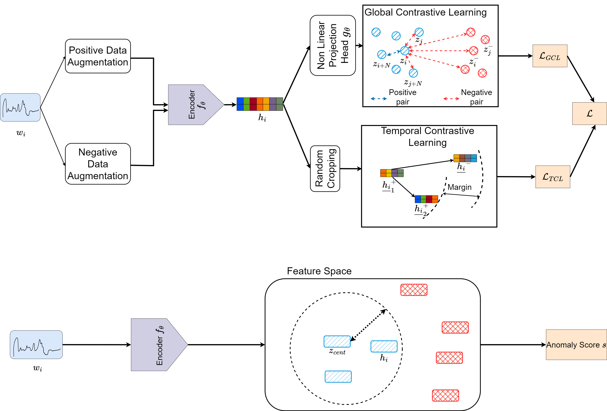

# CATS: Contrastive Learning for Anomaly detection in Time Series

This repository provides the code to implement CATS and reproduce the paper experiments.
The paper is currently under the review and the code will be publicly available upon paper acceptance.

## CATS Architecture



## Datasets
The datasets used in the paper are as follows:
  - Benchmark datasets:
    - SMD ([Server Machine Datasets](https://github.com/NetManAIOps/OmniAnomaly/tree/master/ServerMachineDataset))
    - MSL ([Mars Science Laboratory](https://pds-atmospheres.nmsu.edu/data_and_services/atmospheres_data/Mars/Mars.html))
    - SMAP ([Soil Moisture Active Passive](https://nsidc.org/data/smap/smap-data.html))
  - Cloud gaming datasets:
    - STD ([Google Stadia](https://stadia.google.com/gg/))
    - GFN ([NVIDIA GeForceNow](https://www.nvidia.com/fr-fr/geforce-now/))
    - XC ([Microsoft XCloud](https://www.xbox.com/fr-FR/cloud-gaming))


The benchmark datasets are public and available on internet while the cloud gaming datasets where collected on cloud gaming platforms for QoE degradation detection and can be found in [this link](https://cloud-gaming-traces.lhs.loria.fr/ANR-19-CE25-0012_std_gfn_xc_cg_webrtc_metrics.7z).

Follow the following commands to get them.

### SMD

```bash
cd datasets
mkdir smd
```

SMD can be downloaded [here](https://github.com/NetManAIOps/OmniAnomaly/tree/master/ServerMachineDataset).

Download and place the directories `interpretation_label`, `test`, `test_label` and `train` in the folder `datasets/smd`.

### SMAP and MSL

To get SMAP and MSL datasets, do the commands below:

```bash
cd datasets
wget https://s3-us-west-2.amazonaws.com/telemanom/data.zip && unzip data.zip && rm data.zip
mv data smap_msl
cd smap_msl && wget https://raw.githubusercontent.com/khundman/telemanom/master/labeled_anomalies.csv
```

### Cloud gaming datasets

Unzip the file in the data folder.

```bash
mv ANR-19-CE25-0012_std_gfn_xc_cg_webrtc_metrics.tar.xz cg.tar.xz
cp cg.tar.xz datasets/
cd datasets
tar -xvf cg.tar.xz && rm cg.tar.gz
```


## Dependencies

The main dependencies are the following:
- Python 3.10+
- Torch
- Tensorboard
- Numpy
- Matplotlib
- Pandas
- Scikit-Learn

## Installation

We first recommend you to create a Python env to install the required packages

```bash
python -m venv cats_env python=3.10
source cats_env/bin/acivate
pip install -r requirements.txt
```

## Usage

```bash
python setup.py install --user
```

To reproduce the paper experiments use the scripts in the `scripts/` folder. All the results will be found in a folder named `outputs`.
- For model comparison on AD using one of the following dataset (`data_name` in {smd, msl, smap, gfn, std, xc}), launch the script file `{data_name}.sh`. For example to compare the 8 models with GFN dataset do:
  ```bash
  scripts/gfn.sh
  ```
- To reproduce ablation studies on loss component, do:
  ```bash
  scripts/loss_ablation.sh
  ```
- To reproduce experiment on data augmentation impact, do:
  ```bash
  scripts/augmentation.sh
  ```
- To reproduce experiment on hyperparameters sensitivity, do:
  ```bash
  scripts/sensitivity.sh
  ```
- To reproduce experiment on data contamination robustness, do:
  ```bash
  scripts/contamination.sh
  ```


## Code description


```bash
.                           
├── README.md                   <- This file
├── cats.py                     <- CATS model.
├── datasets.tar.gz
├── datasets                    <- Folder where the datasets will be stored.
├── encoders                    <- Encoders type used.
├── experiments                 <- Folder with all experiments files.
├── losses                      <- Folder with all loss functions.
    ├── dtw_loss.py             <- Soft-DTW loss.
    ├── gcl.py                  <- Global Contrastive Learning loss.
    ├── tcl.py                  <- Temporal Contrastive Learning loss.
├── models                      <- Folder with the AD models used for comparison.
├── requirements.txt            <- The required packages.
├── scripts                     <- The scripts files to reproduce paper experiments.
├── setup.py                    <- Installation file.
└── utils                       <- Utils folder
    ├── augmentation.py         <- Data augmentation file.
    ├── datasets                <- Folder with data processing files.
    ├── evaluation_utils.py     <- File with evaluation utils code.
    └── time_series_dataset.py  <- File for time series data loading.
```